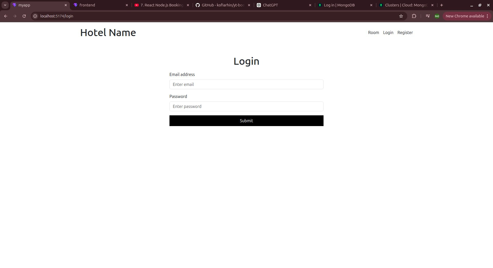
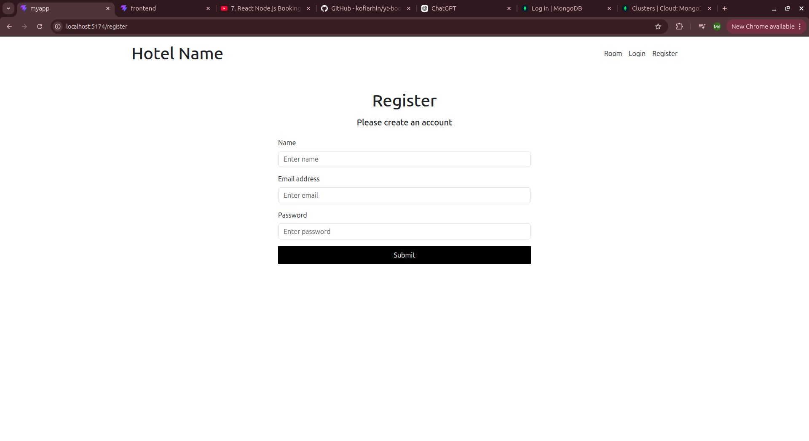
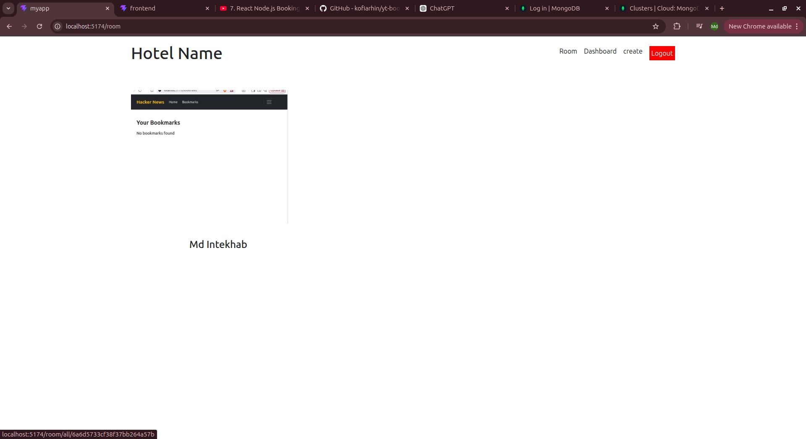
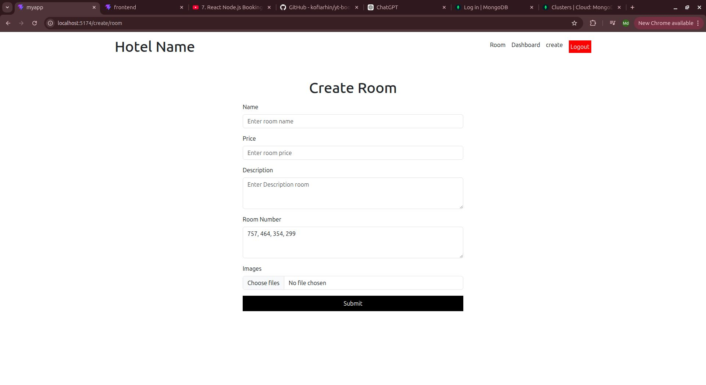
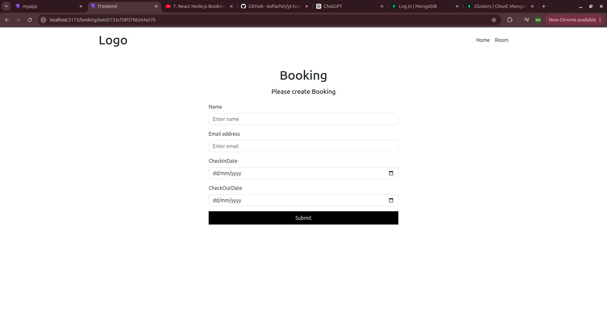

# 🏨 Hotel Booking System

A Full Stack Hotel Booking System built with the MERN Stack. This application allows users to register, login, browse hotel rooms, and book rooms online. The admin can manage rooms, upload room images, and view all bookings.

---

## 🚀 Features

### User Features
- User Registration
- User Login & Logout
- JWT Authentication
- Browse Hotel Rooms
- Book Rooms
- View Room Details

### Admin Features
- Create Room
- Update Room
- Delete Room
- Upload Multiple Images
- View Booking Dashboard
- Manage Bookings

---

## 🛠 Tech Stack

### Frontend
- React.js
- Redux Toolkit
- React Router DOM
- Bootstrap

### Backend
- Node.js
- Express.js
- MongoDB
- Mongoose
- JWT
- Cloudniary
- bcryptjs

---

## 📸 Screenshots

### Login Page



---

### Register Page



---

### Room List



---

### Create Room



---

### Booking Page



---

### Dashboard


---

## 📂 Folder Structure

```text
hotelBooking/
│
├── admin/
├── backend/
├── frontend/
├── screenshot/
│   ├── booking.jpg
│   ├── dashboard.jpg
│   ├── list.jpg
│   ├── login.jpg
│   ├── register.jpg
│   └── room.jpg
│
└── README.md
```

---

## ⚙ Installation

### Clone Repository

```bash
git clone https://github.com/ginisys9/hotelBooking.git
```

### Backend

```bash
cd backend
npm install
npm run dev
```

### Frontend

```bash
cd frontend
npm install
npm run dev
```

---

## 🔐 Environment Variables

Create a `.env` file inside the backend folder.

```env
PORT=3000
MONGO_URI=Your MongoDB URI
JWT_SECRET=Your Secret Key
```

---

## API Endpoints

### User

- POST /user/register
- POST /user/login

### Room

- GET /room
- GET /room/:id
- POST /room/create
- PUT /room/update/:id
- DELETE /room/delete/:id

### Booking

- POST /booking/create
- GET /booking

---

## ✨ Future Improvements

- Email Notifications
- Room Availability
- Search & Filter
- Rating & Review
- Forgot Password

---

## 👨‍💻 Author

**MD Intekhab**

GitHub: https://github.com/ginisys9

---

⭐ If you like this project, don't forget to give it a Star.# 🏨 Hotel Booking System (MERN Stack)

A full-stack Hotel Booking System built using the MERN Stack. Users can register, login, browse hotel rooms, and book available rooms. The admin can manage rooms, view bookings, and perform CRUD operations.

---

## 🚀 Features

### 👤 User
- User Registration
- User Login & Logout
- JWT Authentication
- View Available Rooms
- Book Hotel Rooms
- View Room Details
- Responsive UI

### 🛠️ Admin
- Secure Admin Login
- Create New Room
- Update Room Details
- Delete Room
- Upload Room Images
- View All Bookings
- Booking Management Dashboard

---

## 📸 Screenshots

### Login Page


### Register Page


### Room Listing


### Create Room


### Dashboard


### Booking Page


---

# 🛠 Tech Stack

## Frontend
- React.js
- React Router DOM
- Redux Toolkit
- Axios
- Bootstrap 5
- HTML5
- CSS3

## Backend
- Node.js
- Express.js
- MongoDB
- Mongoose
- JWT Authentication
- bcryptjs
- Multer

---

# 📁 Folder Structure

```
Hotel-Booking/
│
├── frontend/
│   ├── src/
│   ├── public/
│   └── package.json
│
├── backend/
│   ├── controller/
│   ├── model/
│   ├── routes/
│   ├── middleware/
│   ├── uploads/
│   ├── app.js
│   └── package.json
│
└── README.md
```

---

# ⚙ Installation

## Clone Repository

```bash
git clone https://github.com/yourusername/hotel-booking.git
```

Move into project

```bash
cd hotel-booking
```

---

## Backend Setup

```bash
cd backend
npm install
npm run dev
```

---

## Frontend Setup

```bash
cd frontend
npm install
npm run dev
```

---

# 🔐 Environment Variables

Create a `.env` file inside backend.

```env
PORT=3000

MONGO_URI=your_mongodb_connection

JWT_SECRET=your_secret_key
```

---

# API Endpoints

## User

| Method | Endpoint |
|---------|----------|
| POST | /user/register |
| POST | /user/login |

---

## Room

| Method | Endpoint |
|---------|----------|
| GET | /room |
| GET | /room/:id |
| POST | /room/create |
| PUT | /room/update/:id |
| DELETE | /room/delete/:id |

---

## Booking

| Method | Endpoint |
|---------|----------|
| POST | /booking/create |
| GET | /booking |
| GET | /booking/:id |

---

# Project Features

✅ Authentication using JWT

✅ Password Hashing using bcrypt

✅ Image Upload using Multer

✅ MongoDB Database

✅ Protected Routes

✅ CRUD Operations

✅ Room Booking System

✅ Admin Dashboard

✅ Responsive Design

---

# Future Improvements

- Payment Gateway Integration
- Room Availability Calendar
- Email Notifications
- Booking Cancellation
- Rating & Reviews
- Search & Filter Rooms
- Pagination
- Forgot Password
- Admin Analytics Dashboard

---

# Author

**MD Intekhab**

MERN Stack Developer

GitHub: https://github.com/yourusername

LinkedIn: https://linkedin.com/in/yourusername

---

# License

This project is licensed under the MIT License.
